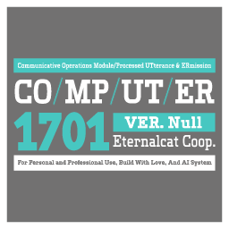

# CO/MP/UT/ER

[](https://www.rust-lang.org/)
[](https://www.microsoft.com/windows/)

<div align="right"><strong><a href="README_zh.md">📄 <em>中文版</em></a></strong></div>

**CO/MP/UT/ER** is a Windows utility that provides sci-fi-inspired auditory feedback for system events. Named in homage to the iconic computer systems from *Star Trek* and *Alien*, this application transforms your PC's standard notifications into clear, configurable voice prompts, creating a more immersive and informative user experience.

The application runs silently in the background, speaking only when important system status changes occur.

---

## ✨ Features

- **Sci-Fi Style Auditory Alerts**: Get notified with clear, configurable voice prompts for a wide range of system events.
- **Real-time System Monitoring**: A hybrid event-driven architecture ensures high efficiency and low resource usage.
- **Dynamic Text-to-Speech (TTS)**: All voice prompts are generated on-the-fly, eliminating the need for pre-recorded audio files.
- **Intelligent Voice Selection**:
    - **User-configurable**: Manually select your favorite TTS voice via a configuration file.
    - **Automatic Language Matching**: Automatically selects a voice that matches the application's locale.
    - **English Fallback**: Defaults to a clear English voice if no suitable localized voice is found.
- **Full Internationalization (i18n) Support**: All prompt texts are stored in external JSON files, making it easy to add new languages.
- **System Tray Integration**:
    - Runs unobtrusively in the system tray.
    - A right-click context menu allows you to pause/resume announcements or open the settings panel.
    - An option to automatically start with Windows is available in the settings.
- **Sleep Mode Aware**: Intelligently detects when the system enters or resumes from sleep mode, preventing a flood of notifications upon waking.

### Monitored Events
- **Power Management**:
    - AC power connected / disconnected.
    - Battery physically inserted / removed (with current charge level announcement).
- **Device Connectivity**:
    - USB device plugged in / unplugged.
- **System State**:
    - Application startup (greets the current Windows user by name).
    - System entering / resuming from sleep.
- **Network Status**:
    - Network connected / disconnected.
    - **Intelligently distinguishes** between Wi-Fi, Cellular (WWAN), and Ethernet connections.
    - Announces the Wi-Fi SSID upon connection.

---

## 🚀 Getting Started

### Installation
1.  Go to the [Releases page](https://github.com/ECeternalcat/CO-MP-UT-ER/releases).
2.  Download the latest `COMPUTER.zip` file.
3.  Unzip the archive to a location of your choice (e.g., `C:\Program Files\COMPUTER`).
4.  Double-click `COMPUTER.exe` to run the application. An icon will appear in your system tray.

### Configuration
You can customize the application's behavior by editing the `config.json` file located in the same directory as the executable.

**Example `config.json`:**
```json
{
  "custom_voice": "Microsoft Zira Desktop",
  "auto_start": true
}
```
- `custom_voice`: (Optional) The full name of the TTS voice you want to use. This overrides automatic selection.
- `auto_start`: (Optional) Set to `true` to have the application start automatically when you log into Windows.

To find the names of all available voices on your system, you can run the `list_voices.exe` utility included in the release.

---

## 🛠️ Technology Stack

This project is a showcase of modern Rust development for the Windows platform, blending traditional Win32 APIs with the modern Windows Runtime (WinRT).

- **Core Language**: **Rust**
- **Concurrency & Asynchronicity**: `std::thread`, `mpsc` channels, `tokio`.
- **Windows Integration**: `windows-rs` crate (Win32 & WinRT).
- **Dependencies**: `tts`, `serde`.

---

## 🤝 Contributing

Contributions are welcome! If you have ideas for new features, bug fixes, or improvements, please feel free to open an issue or submit a pull request on the project's GitHub repository.
